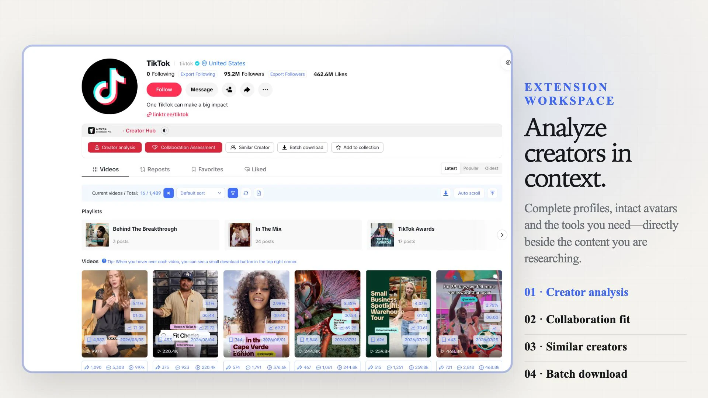
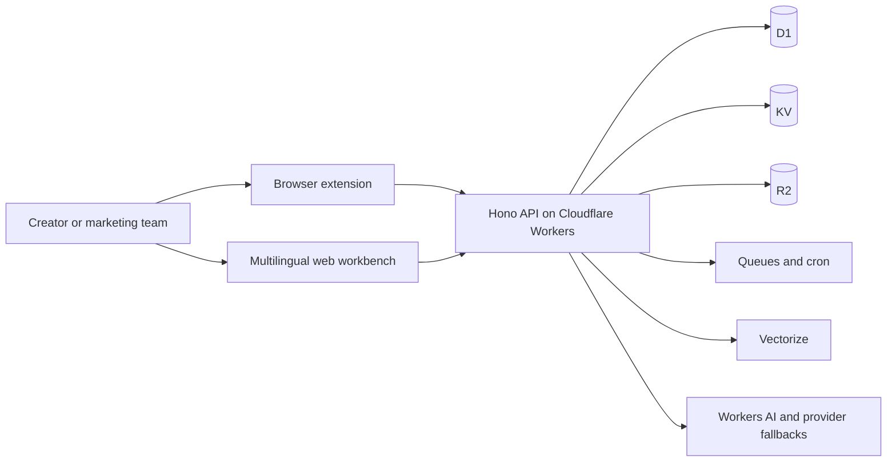

# AI TikTok Analyzer Pro

[](https://tiktok.poviai.com/)
[](https://github.com/Jiaye-apple/ai-tiktok-analyzer-pro/actions/workflows/ci.yml)
[](https://developers.cloudflare.com/workers/)
[](https://www.typescriptlang.org/)
[](#international-seo-and-localization)
[](https://github.com/Jiaye-apple/ai-tiktok-analyzer-pro/releases/latest)

**AI TikTok Analyzer Pro is a TikTok creator research, video download, transcript, script-analysis and audience-insight platform.** It combines a browser extension experience with a multilingual web workbench and an edge-native Cloudflare Workers backend for creators, influencer marketers, ecommerce teams and social-media researchers.

[Open the product](https://tiktok.poviai.com/) · [Sort a creator’s videos](https://tiktok.poviai.com/tools/tiktok-video-sorter) · [Export comments](https://tiktok.poviai.com/tools/export-tiktok-comments) · [Download subtitles](https://tiktok.poviai.com/tools/tiktok-subtitle-downloader) · [Blog](https://tiktok.poviai.com/blog) · [Read the guide](https://tiktok.poviai.com/kol/guide)

Source mirrors: [GitHub](https://github.com/Jiaye-apple/ai-tiktok-analyzer-pro) · [Gitee](https://gitee.com/jerrylinap/ai-tiktok-analyzer-pro)



## Install the browser extension

| Channel | Link |
|---|---|
| Chrome Web Store | [AI TikTok Analyzer Pro for Chrome](https://chromewebstore.google.com/detail/ai-tiktok-analyzer-pro/cgnemfnpkodogmbpdchgejohnnpgamho) |
| Microsoft Edge Add-ons | [AI TikTok Analyzer Pro for Edge](https://microsoftedge.microsoft.com/addons/detail/ai-tiktok-analyzer-pro/okmglmemcolofokocjhncoaibejejkkd) |
| Manual install | [Latest release packages](https://github.com/Jiaye-apple/ai-tiktok-analyzer-pro/releases/latest) — Chrome and Edge zips with SHA-256 checksums |

Manual installation from a release package:

1. Download the Chrome or Edge zip from the [Releases page](https://github.com/Jiaye-apple/ai-tiktok-analyzer-pro/releases) and unzip it.
2. Open `chrome://extensions` (or `edge://extensions`) and enable **Developer mode**.
3. Click **Load unpacked** and select the unzipped folder.

Release packages are produced by the same build pipeline as the store submissions; every release lists the exact SHA-256 checksums so you can verify that the archive you downloaded matches the published build.

## Why this project stands out

- **Creator intelligence in one workflow** — search public creator profiles, compare follower and engagement signals, inspect rankings and save research shortlists.
- **Media tools built into the research flow** — download permitted TikTok videos, HD variants, MP3 audio and cover images without switching between unrelated tools.
- **AI-assisted content analysis** — turn public videos into transcripts, bilingual captions, structured scripts, summaries, rewrites and creative briefs.
- **Extension plus web workbench** — use contextual tools while browsing TikTok, then continue research, task management and exports on the web.
- **Nine-language product surface** — Simplified Chinese, Traditional Chinese, English, Japanese, Korean, Vietnamese, Indonesian, Spanish and Portuguese.
- **Edge-native architecture** — Hono and TypeScript on Cloudflare Workers, with D1, KV, R2, Queues, Vectorize and Workers AI integrations.
- **Resilient provider design** — AI, speech-to-text and video-resolution paths support ordered fallbacks instead of depending on one provider.
- **Privacy-aware media delivery** — the media proxy streams responses without persisting downloaded media in application storage.

## Product surfaces

| Surface | What users can do | Primary audience |
|---|---|---|
| Browser extension | Analyze public TikTok pages, collect research signals, translate, transcribe and use download tools in context | Creators and daily researchers |
| Web workbench | Search creators and videos, browse rankings, manage tasks, review saved data and use standalone tools | Marketing and ecommerce teams |
| Cloudflare backend | Handle authentication, quotas, AI workflows, media resolution, exports, payments and asynchronous jobs | Product and platform operations |
| Public knowledge pages | Explain features, pricing, privacy, terms, guides and focused tools in nine languages | Search visitors and evaluators |

## Architecture



The Worker serves both product pages and API routes. This keeps authentication, localization, quotas and product rules aligned while still allowing background jobs and specialist providers to degrade independently.

## SEO and discovery matrix

The public website uses focused landing pages instead of forcing unrelated search intents onto one homepage. The URLs below are canonical product surfaces; keyword demand, rankings and traffic are not claimed without first-party or dated research data.

| Search intent | Topic cluster | Canonical page | User outcome |
|---|---|---|---|
| Product / navigational | AI TikTok Analyzer Pro, TikTok creator analytics | [Homepage](https://tiktok.poviai.com/) | Understand the full platform |
| Transactional tool | TikTok video downloader, HD video, MP3, cover image | [Video downloader](https://tiktok.poviai.com/tools/video-download) | Process an authorized TikTok URL |
| Informational tool | TikTok script analysis, hook, CTA, creative brief | [Script analysis](https://tiktok.poviai.com/tools/script-analysis) | Break down content structure |
| Informational tool | TikTok hashtags, content research | [Hashtag tool](https://tiktok.poviai.com/tools/hashtag-generator) | Explore and copy relevant tags |
| Commercial research | TikTok influencer search, creator discovery | [Creator search](https://tiktok.poviai.com/kol/search) | Build a creator shortlist |
| Commercial research | TikTok influencer rankings, engagement rate | [Creator rankings](https://tiktok.poviai.com/kol/kol-rank) | Compare public creator signals |
| Trend research | Trending TikTok videos, viral content research | [Video rankings](https://tiktok.poviai.com/kol/video-rank) | Discover high-performing content |
| Ecommerce research | TikTok Shop product rankings | [Product rankings](https://tiktok.poviai.com/kol/product-rank) | Compare product demand signals |
| Support / how-to | Install extension, TikTok analytics guide | [User guide](https://tiktok.poviai.com/kol/guide) | Complete setup and common workflows |
| Commercial / transactional | TikTok analytics pricing | [Pricing](https://tiktok.poviai.com/price) | Compare plans and allowances |
| Transactional tool | Sort TikTok videos by views, likes, date | [Video sorter](https://tiktok.poviai.com/tools/tiktok-video-sorter) | Surface a creator’s best-performing posts |
| Transactional tool | Export TikTok comments to Excel or CSV | [Comment exporter](https://tiktok.poviai.com/tools/export-tiktok-comments) | Turn a comment section into a spreadsheet |
| Transactional tool | Translate TikTok comments in bulk | [Comment translator](https://tiktok.poviai.com/tools/translate-tiktok-comments) | Read audience reactions in nine languages |
| Transactional tool | Download TikTok subtitles, SRT, transcripts | [Subtitle downloader](https://tiktok.poviai.com/tools/tiktok-subtitle-downloader) | Get text even when a video has no captions |
| Informational tool | TikTok hook analysis, first three seconds | [Hook analyzer](https://tiktok.poviai.com/tools/tiktok-hook-analyzer) | Classify the opening pattern of a video |
| Transactional tool | Download all videos from a TikTok account | [Bulk downloader](https://tiktok.poviai.com/tools/bulk-download-tiktok-videos) | Filter first, then queue an authorized batch |
| Transactional tool | TikTok video to text, AI transcription | [Video to text](https://tiktok.poviai.com/tools/tiktok-video-to-text) | Get a transcript even without captions |
| Informational tool | TikTok comment analysis, themes, sentiment | [Comment analysis](https://tiktok.poviai.com/tools/tiktok-comment-analysis) | Read a summary instead of scrolling |
| Ecommerce research | TikTok Shop video and content research | [Shop content research](https://tiktok.poviai.com/tools/tiktok-shop-video-research) | Study how a product is actually sold |
| Commercial research | Compare TikTok creators side by side | [Creator comparison](https://tiktok.poviai.com/tools/compare-tiktok-creators) | Build an exportable shortlist |
| Informational content | Tool comparisons, research guides | [Blog](https://tiktok.poviai.com/blog) | Compare options before committing |

### Technical SEO foundation

- Canonical URLs on public pages and a single preferred host: `https://tiktok.poviai.com`
- Reciprocal `hreflang` output for nine languages plus `x-default`
- XML sitemap and `robots.txt` discovery controls
- Open Graph and Twitter Card metadata with a 1200 × 630 social image
- Structured data aligned with visible product content
- Real HTML `404` responses for browser navigation while retaining the API error contract
- Explicit `noindex` behavior for login, workbench, forms, callbacks and protected surfaces
- GitHub and Gitee repository names, descriptions and topics aligned with the same product entity and canonical website

These signals improve crawlability and consistency; they do not guarantee indexing, rankings, rich results or AI citations.

## Guides and tool comparisons

Long-form research guides and honest tool comparisons published on the product blog. Competitor names are used nominatively; each trademark belongs to its owner.

- [TikTok Research Reporting Clients Actually Read](https://tiktok.poviai.com/blog/agency-tiktok-reporting-workflow-2026) — How agencies turn TikTok research into a deliverable clients read: a one-page decision doc, a linked evidence appendix, and a repeatable monthly workflow.
- [Turn TikTok Comments into Product Research (2026 Guide)](https://tiktok.poviai.com/blog/analyze-tiktok-comments-for-product-research-2026) — Mine TikTok comments for purchase objections, unexpected use cases, and competitor mentions — a repeatable coding method, plus what TikTok won't export.
- [Free TikTok Downloader Extensions: What to Check Before Installing](https://tiktok.poviai.com/blog/best-free-tiktok-downloader-extensions-2026) — Before installing a TikTok downloader extension, check its permissions, update history, and developer identity. Here is how to do each check.
- [10 Best Free TikTok Research Tools in 2026](https://tiktok.poviai.com/blog/best-free-tiktok-research-tools-2026) — Ten free TikTok research tools for 2026: no-signup web tools, official TikTok resources, open-source downloaders, and a free-quota extension.
- [Best TikTok Chrome Extensions in 2026: 5 Verified Picks](https://tiktok.poviai.com/blog/best-tiktok-chrome-extensions-2026) — Five TikTok Chrome extensions with install counts and ratings verified on 16 August 2026, plus the nine jobs these tools do and how to vet any listing.
- [6 Best TikTok Comment Analysis Tools in 2026](https://tiktok.poviai.com/blog/best-tiktok-comment-analysis-tools-2026) — TikTok has no comment export and no bulk translation. Compare six tools that pull, translate, and analyze TikTok comments, with honest trade-offs.
- [7 Best TikTok Comment Export Tools in 2026](https://tiktok.poviai.com/blog/best-tiktok-comment-export-tools-2026) — TikTok has no native comment export. Seven ways to get comments into Excel or CSV in 2026, compared on format, translation, analysis and price.
- [8 Best TikTok Transcript Generators in 2026 (Free and Paid)](https://tiktok.poviai.com/blog/best-tiktok-transcript-generators-2026) — Eight ways to get a TikTok transcript in 2026, free and paid, compared on captionless video support, batch mode, output formats and price.
- [Countik Alternatives in 2026: Free TikTok Tools That Go Deeper](https://tiktok.poviai.com/blog/countik-alternative-2026) — Countik's free tools answer number questions well. Here are five alternatives for 2026 when you need transcripts, comment exports, and real research.
- [Researching TikTok in a Language You Don't Speak (2026 Playbook)](https://tiktok.poviai.com/blog/cross-border-tiktok-research-language-barrier-2026) — How cross-border sellers read TikTok audience reaction in unfamiliar languages: batch comment translation, transcripts, and what machine translation loses.
- [How to Get the Audio from a TikTok Video (and When You May Not)](https://tiktok.poviai.com/blog/download-tiktok-audio-mp3-2026) — Extract audio or a transcript from a TikTok video, and understand the copyright limits that decide what you are allowed to do with the result.
- [DownSub Alternatives for TikTok Transcripts (2026)](https://tiktok.poviai.com/blog/downsub-alternative-tiktok-transcripts-2026) — DownSub only downloads subtitles that already exist. Here are the 2026 alternatives that transcribe TikTok audio when a video has no captions at all.
- [EchoTik Alternatives in 2026: 5 TikTok Research Tools Compared](https://tiktok.poviai.com/blog/echotik-alternative-tiktok-tools-2026) — EchoTik alternatives for 2026: five TikTok research tools compared by data depth, price, and fit, with free options for content-first teams.
- [Exolyt Alternatives in 2026: TikTok Analytics Without the Enterprise Price](https://tiktok.poviai.com/blog/exolyt-alternative-2026) — Six Exolyt alternatives for 2026, from free TikTok calculators to commerce data platforms — with honest notes on which ones are actively maintained.
- [FastMoss Alternatives in 2026: 5 TikTok Analytics Tools Compared (Free Options Included)](https://tiktok.poviai.com/blog/fastmoss-alternative-tiktok-analytics-2026) — FastMoss alternatives for 2026: five options compared on price and fit, including free routes for teams that only need content research.
- [FastMoss vs Kalodata (2026): Which TikTok Analytics Platform Fits Your Workflow?](https://tiktok.poviai.com/blog/fastmoss-vs-kalodata-2026) — A third-party FastMoss vs Kalodata comparison for 2026: pricing, data focus, and fit — plus a free route if you only need public-page research.
- [How to Find and Evaluate TikTok Creators in Languages You Don't Speak](https://tiktok.poviai.com/blog/find-tiktok-creators-in-any-language-2026) — Vet TikTok creators in languages you don't read: translate comment threads in bulk, transcribe what they actually say, and compare profiles side by side.
- [12 Free TikTok Analytics Tools in 2026 (What Each One Actually Does)](https://tiktok.poviai.com/blog/free-tiktok-analytics-tools-2026) — Twelve free TikTok tools in 2026: official TikTok resources, free calculators, open-source downloaders, and free web tools — what each actually does.
- [How to Download All Videos from a TikTok Account (3 Methods, 2026)](https://tiktok.poviai.com/blog/how-to-download-all-videos-from-tiktok-account-2026) — Three ways to download every video from a TikTok account in 2026: a browser extension, the yt-dlp command line, and TikTok's own data export.
- [Kalodata Alternatives in 2026: 5 Tools for TikTok Research (Including Free Options)](https://tiktok.poviai.com/blog/kalodata-alternative-tiktok-research-2026) — Five Kalodata alternatives for 2026 — from a free browser extension for public-page research to full GMV data platforms, with honest fit notes.
- [Kalodata vs EchoTik (2026): Which TikTok Data Platform Fits Your Team?](https://tiktok.poviai.com/blog/kalodata-vs-echotik-2026) — A third-party Kalodata vs EchoTik comparison for 2026: pricing transparency, data focus, free tools, and how to run a trial that actually decides it.
- [KOLSprite Alternatives in 2026: TikTok Downloader Extensions and Research Tools Compared](https://tiktok.poviai.com/blog/kolsprite-alternative-tiktok-downloader-2026) — KOLSprite alternatives for 2026: browser extensions and platforms for TikTok download, sorting, and analysis compared, with honest trade-offs.
- [Turn TikTok Videos into Blog Posts and Newsletters (2026 Workflow)](https://tiktok.poviai.com/blog/repurpose-tiktok-videos-into-blog-posts-2026) — A repeatable workflow for turning your TikTok videos into blog posts and newsletters: transcribe, restructure, and rewrite for readers.
- [Shoplus Alternatives in 2026: 5 TikTok Research Tools Compared](https://tiktok.poviai.com/blog/shoplus-alternative-2026) — Five Shoplus alternatives for 2026, ordered by how close each sits to shop analytics — plus an honest note on when a data platform is overkill.
- [SnapTik Alternatives in 2026: From One-Off Downloads to a Research Workflow](https://tiktok.poviai.com/blog/snaptik-alternative-2026) — SnapTik alternatives for 2026, compared by how far past the download they take you: extension, CLI, desktop, analytics SaaS and TikTok's own tools.
- [SSSTik Alternatives in 2026: 6 Ways to Save TikTok Videos (Extension, CLI, Desktop)](https://tiktok.poviai.com/blog/ssstik-alternative-chrome-extension-2026) — Six SSSTik alternatives compared: browser extension, command line, desktop app and official export, with honest pros, cons and 2026 pricing.
- [TikBuddy Is Now Crevideo: 5 Alternatives for TikTok Content Research (2026)](https://tiktok.poviai.com/blog/tikbuddy-crevideo-alternative-2026) — tikbuddy.com now redirects to crevideo.com, and the product has pivoted. Here are five alternatives for the TikTok research TikBuddy used to cover.
- [How to Pick TikTok Affiliate Products Using Public Content Signals](https://tiktok.poviai.com/blog/tiktok-affiliate-product-research-2026) — Judge a TikTok affiliate product before you request samples: read demo performance, comment intent, and how saturated the angle already is.
- [How to Read TikTok Comment Sentiment Without Guessing (2026)](https://tiktok.poviai.com/blog/tiktok-comment-sentiment-analysis-guide-2026) — Scrolling comments skews your read toward the loudest few. Here is a repeatable way to export, translate, cluster, and sentiment-check TikTok comments.
- [A TikTok Competitor Research Workflow That Takes 30 Minutes (2026)](https://tiktok.poviai.com/blog/tiktok-competitor-research-workflow-2026) — A five-step, 30-minute TikTok competitor research workflow: build a shortlist, sort for outliers, transcribe hooks, mine comments, export a brief.
- [Build a TikTok Content Calendar from Competitor Research (2026)](https://tiktok.poviai.com/blog/tiktok-content-calendar-from-competitor-research-2026) — Turn competitor outliers into a four-week TikTok calendar: sort profiles for breakouts, pull hooks as text, cluster themes, then schedule and review.
- [The Creator Outreach Brief That Gets Replies](https://tiktok.poviai.com/blog/tiktok-creator-outreach-brief-2026) — A research-first approach to TikTok creator outreach, with a copy-paste first-message template, a one-page attachment, and a follow-up cadence that works.
- [Hashtag Research for TikTok That Isn't Guesswork](https://tiktok.poviai.com/blog/tiktok-hashtag-research-workflow-2026) — This workflow replaces hashtag guesswork with evidence from top videos, real comment language, and a tag log you review every few weeks.
- [9 TikTok Hook Formulas (and How to Find Which One a Video Used)](https://tiktok.poviai.com/blog/tiktok-hook-formulas-2026) — Nine TikTok hook structures with templates and failure modes, plus a method for reverse-engineering which formula any video used from its transcript.
- [11 TikTok Research Mistakes That Waste Your Week](https://tiktok.poviai.com/blog/tiktok-research-mistakes-2026) — Eleven habits that turn TikTok research into wasted hours — follower-count ranking, recency bias, skipped comments, manual copying — each with the fix.
- [Buying a TikTok Research Tool: 8 Questions to Ask First](https://tiktok.poviai.com/blog/tiktok-research-tool-buying-guide-2026) — Eight questions to ask before you buy a TikTok research tool, covering data sources, exports, languages, seats, permissions, retention, and exit cost.
- [Teardown: The Four Parts of a TikTok Script That Sells](https://tiktok.poviai.com/blog/tiktok-script-structure-teardown-2026) — A teardown of the four parts of a selling TikTok script — hook, proof, offer, and CTA — with recognizable markers and example structures for each.
- [Audit a TikTok Shop Competitor's Content in One Afternoon](https://tiktok.poviai.com/blog/tiktok-shop-competitor-content-audit-2026) — Audit a TikTok Shop competitor's public videos, transcripts, and comments in one afternoon, and learn what this method cannot tell you.
- [How to Vet TikTok Shop Creators Before You Pay Them (2026)](https://tiktok.poviai.com/blog/tiktok-shop-creator-vetting-guide-2026) — A public-data due diligence checklist for TikTok Shop sellers: baseline reach, commerce ratio, comment authenticity, and audience language.
- [Translating TikTok Subtitles for Cross-Border Campaigns](https://tiktok.poviai.com/blog/tiktok-subtitle-translation-workflow-2026) — A step-by-step workflow for transcribing and translating TikTok subtitles across markets, including where machine translation reliably breaks down.
- [The TikTok UGC Brief Template That Creators Actually Follow](https://tiktok.poviai.com/blog/tiktok-ugc-brief-template-2026) — Write TikTok UGC briefs creators follow: research hooks and comment objections first, specify outcomes not shot lists, plus a copy-paste template.
- [What TikTok Video Data You Can Actually Export in 2026](https://tiktok.poviai.com/blog/tiktok-video-metadata-export-2026) — A field-by-field look at which TikTok video data is public and exportable in 2026, which is only estimated, and which no third-party tool can give you.
## International SEO and localization

The source dictionaries live under `i18n/<locale>/`. Every locale must keep the same keys, placeholders and HTML-tag structure.

Supported product locales:

`zh-CN` · `zh-TW` · `en-US` · `ja-JP` · `ko-KR` · `vi-VN` · `id-ID` · `es-ES` · `pt-PT`

Rebuild and validate generated catalogs with:

```bash
node scripts/build-i18n.mjs
node scripts/check-i18n.mjs
```

### Translated guides

Guides are also published as native-language articles rather than machine translations of the English text, each with its own URL and reciprocal hreflang annotations.

**Spanish**

- [Cómo descargar todos los videos de una cuenta de TikTok (3 métodos, 2026)](https://tiktok.poviai.com/blog/descargar-todos-los-videos-de-una-cuenta-de-tiktok-2026) — Tres formas de descargar todos los videos de una cuenta de TikTok en 2026: extensión de navegador, línea de comandos yt-dlp y exportación oficial.
- [Los 8 mejores generadores de transcripciones de TikTok en 2026 (gratis y de pago)](https://tiktok.poviai.com/blog/mejores-generadores-de-transcripciones-tiktok-2026) — Ocho formas de obtener la transcripción de un video de TikTok en 2026, gratis y de pago, comparadas por soporte sin subtítulos, lotes, formatos y precio.
- [Las 7 mejores herramientas para exportar comentarios de TikTok en 2026](https://tiktok.poviai.com/blog/mejores-herramientas-exportar-comentarios-tiktok-2026) — TikTok no permite exportar comentarios. Siete formas de llevarlos a Excel o CSV en 2026, comparadas por formato, traducción, análisis y precio.

**Indonesian**

- [7 Alat Ekspor Komentar TikTok Terbaik di 2026](https://tiktok.poviai.com/blog/alat-ekspor-komentar-tiktok-terbaik-2026) — TikTok tidak punya ekspor komentar bawaan. Tujuh cara memindahkan komentar ke Excel atau CSV di 2026, dibandingkan dari format, terjemahan, dan harga.
- [Cara Download Semua Video dari Akun TikTok (3 Metode, 2026)](https://tiktok.poviai.com/blog/cara-download-semua-video-dari-akun-tiktok-2026) — Tiga cara download semua video dari akun TikTok di 2026: ekstensi browser, command line yt-dlp, dan ekspor data resmi dari TikTok.
- [8 Pembuat Transkrip TikTok Terbaik di 2026 (Gratis dan Berbayar)](https://tiktok.poviai.com/blog/pembuat-transkrip-tiktok-terbaik-2026) — Delapan cara mendapatkan transkrip TikTok di 2026, gratis dan berbayar, dibandingkan dari dukungan video tanpa subtitle, mode batch, format, dan harga.

**Portuguese**

- [Como baixar todos os vídeos de uma conta do TikTok (3 métodos, 2026)](https://tiktok.poviai.com/blog/baixar-todos-os-videos-de-uma-conta-do-tiktok-2026) — Três formas de baixar todos os vídeos de uma conta do TikTok em 2026: extensão de navegador, linha de comando com yt-dlp e a exportação oficial do TikTok.
- [11 erros de pesquisa no TikTok que desperdiçam a sua semana](https://tiktok.poviai.com/blog/erros-de-pesquisa-no-tiktok-2026) — Onze hábitos que transformam a pesquisa no TikTok em horas perdidas — ranquear por seguidores, viés de recência, pular comentários, copiar na mão — com a correção.
- [As 7 melhores ferramentas para exportar comentários do TikTok em 2026](https://tiktok.poviai.com/blog/melhores-ferramentas-exportar-comentarios-tiktok-2026) — O TikTok não exporta comentários. Sete formas de levar comentários para o Excel ou CSV em 2026, comparadas por formato, tradução, análise e preço.
- [Os 8 melhores geradores de transcrição do TikTok em 2026 (grátis e pagos)](https://tiktok.poviai.com/blog/melhores-geradores-de-transcricoes-tiktok-2026) — Oito formas de conseguir a transcrição de um vídeo do TikTok em 2026, grátis e pagas, comparadas por vídeo sem legenda, modo em lote, formatos e preço.

**Vietnamese**

- [8 công cụ tạo bản ghi lời thoại TikTok tốt nhất 2026 (miễn phí và trả phí)](https://tiktok.poviai.com/blog/cong-cu-tao-ban-ghi-tiktok-tot-nhat-2026) — Tám cách lấy bản ghi lời thoại video TikTok năm 2026, miễn phí và trả phí, so sánh video không phụ đề, chế độ hàng loạt, định dạng và giá.
- [7 công cụ xuất bình luận TikTok tốt nhất năm 2026](https://tiktok.poviai.com/blog/cong-cu-xuat-binh-luan-tiktok-tot-nhat-2026) — TikTok không có tính năng xuất bình luận. Bảy cách đưa bình luận ra Excel hoặc CSV năm 2026, so sánh định dạng, dịch, phân tích và giá.
- [11 sai lầm khi nghiên cứu TikTok khiến bạn mất trắng cả tuần](https://tiktok.poviai.com/blog/sai-lam-khi-nghien-cuu-tiktok-2026) — Mười một thói quen biến nghiên cứu TikTok thành hàng giờ lãng phí: xếp hạng theo follower, thiên vị bài mới, bỏ qua bình luận, chép tay — kèm cách sửa.
- [Cách tải tất cả video từ một tài khoản TikTok (3 cách, 2026)](https://tiktok.poviai.com/blog/tai-tat-ca-video-tu-tai-khoan-tiktok-2026) — Ba cách tải toàn bộ video của một tài khoản TikTok năm 2026: tiện ích trình duyệt, dòng lệnh yt-dlp và công cụ xuất dữ liệu chính chủ của TikTok.

## Repository scope

This public mirror includes:

- the Cloudflare Workers backend and server-rendered web workbench;
- D1 migrations, localization sources and generated catalogs;
- unit, route-coverage and smoke-test tooling;
- public website screenshots, video assets and country-flag assets.

It intentionally excludes production credentials, provider keys, Cloudflare resource IDs, private deployment automation and the editable extension source tree. The official browser-store packages for Chrome and Microsoft Edge are published as versioned assets with SHA-256 checksums on the [Releases page](https://github.com/Jiaye-apple/ai-tiktok-analyzer-pro/releases). Internal resource names that remain in the source are compatibility identifiers, not third-party affiliation claims.

## Verify the public source

Node.js 22 or later is recommended.

```bash
cd cloudflare-backend
npm ci
npm run i18n:check
npm run typecheck
npm run test:unit
```

The included `wrangler.jsonc` is a local-development configuration with placeholder resource IDs. Production deployment requires your own Cloudflare resources and secrets; do not commit `.dev.vars`, `SECRETS.md` or provider credentials.

## Frequently asked questions

**What is AI TikTok Analyzer Pro?** A browser extension plus a multilingual web workbench for researching public TikTok creators and videos: sorting and filtering, engagement analytics, AI transcripts and script analysis, comment insights, media tools and data export.

**How do I install it?** From the [Chrome Web Store](https://chromewebstore.google.com/detail/ai-tiktok-analyzer-pro/cgnemfnpkodogmbpdchgejohnnpgamho) or [Microsoft Edge Add-ons](https://microsoftedge.microsoft.com/addons/detail/ai-tiktok-analyzer-pro/okmglmemcolofokocjhncoaibejejkkd), or manually by loading an unzipped [release package](https://github.com/Jiaye-apple/ai-tiktok-analyzer-pro/releases) in developer mode.

**Does it download TikTok videos in HD?** Yes — it saves the highest-quality variant publicly served for a video, plus MP3 audio and cover images, for media you own or are permitted to use.

**Is it free?** Core research tools ship with free daily allowances; higher AI and download volumes are available on paid plans (see [Pricing](https://tiktok.poviai.com/price)).

**Which languages does it support?** Nine: English, Simplified Chinese, Traditional Chinese, Japanese, Korean, Vietnamese, Indonesian, Spanish and Portuguese.

**Is it affiliated with TikTok?** No. It is an independent tool for researching public information and is not affiliated with, endorsed by or sponsored by TikTok.

## Responsible use

AI TikTok Analyzer Pro is an independent product and is not affiliated with, endorsed by or sponsored by TikTok. Analyze public information responsibly and download media only when you own it or have permission from the rights holder. Availability can vary with region, public-page access and upstream platform changes.

Security reports: [support@poviai.com](mailto:support@poviai.com) · [Privacy](https://tiktok.poviai.com/privacy) · [Terms](https://tiktok.poviai.com/terms)

## 中文简介

AI TikTok Analyzer Pro 面向创作者、达人营销和跨境电商团队，覆盖 TikTok 达人搜索与榜单、公开数据分析、视频与音频下载、AI 转写、双语字幕、脚本拆解、评论洞察和研究任务管理。公开仓库展示原创 Cloudflare Workers 后端、九语言官网与 SEO 技术基础；Chrome 与 Edge 官方商店安装包在 [Releases](https://github.com/Jiaye-apple/ai-tiktok-analyzer-pro/releases) 页发布并附 SHA-256 校验值。安装入口：[Chrome 应用商店](https://chromewebstore.google.com/detail/ai-tiktok-analyzer-pro/cgnemfnpkodogmbpdchgejohnnpgamho) · [Edge 外接程序商店](https://microsoftedge.microsoft.com/addons/detail/ai-tiktok-analyzer-pro/okmglmemcolofokocjhncoaibejejkkd)。生产密钥与可编辑扩展源码不公开。

## License

The repository is public for product transparency, security review and technical evaluation. No permission is granted for copying, redistribution, repackaging or commercial use unless the copyright owner provides written authorization. See [LICENSE](LICENSE).
