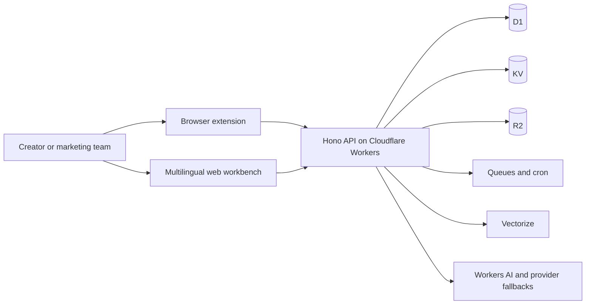

# AI TikTok Downloader Pro

[](https://tiktok.poviai.com/)
[](https://github.com/Jiaye-apple/ai-tiktok-downloader-pro/actions/workflows/ci.yml)
[](https://developers.cloudflare.com/workers/)
[](https://www.typescriptlang.org/)
[](#international-seo-and-localization)

**AI TikTok Downloader Pro is a TikTok creator research, video download, transcript, script-analysis and audience-insight platform.** It combines a browser extension experience with a multilingual web workbench and an edge-native Cloudflare Workers backend for creators, influencer marketers, ecommerce teams and social-media researchers.

[Open the product](https://tiktok.poviai.com/) · [Download a TikTok video](https://tiktok.poviai.com/tools/video-download) · [Search creators](https://tiktok.poviai.com/kol/search) · [Read the guide](https://tiktok.poviai.com/kol/guide)


## Why this project stands out

- **Creator intelligence in one workflow** — search public creator profiles, compare follower and engagement signals, inspect rankings and save research shortlists.
- **Media tools built into the research flow** — download permitted TikTok videos, HD variants, MP3 audio and cover images without switching between unrelated tools.
- **AI-assisted content analysis** — turn public videos into transcripts, bilingual captions, structured scripts, summaries, rewrites and creative briefs.
- **Extension plus web workbench** — use contextual tools while browsing TikTok, then continue research, task management and exports on the web.
- **Nine-language product surface** — Simplified Chinese, Traditional Chinese, English, Japanese, Korean, Vietnamese, Indonesian, Spanish and Portuguese.
- **Edge-native architecture** — Hono and TypeScript on Cloudflare Workers, with D1, KV, R2, Queues, Vectorize and Workers AI integrations.
- **Resilient provider design** — AI, speech-to-text and video-resolution paths support ordered fallbacks instead of depending on one provider.
- **Privacy-aware media delivery** — the media proxy streams responses without persisting downloaded media in application storage.

## Product surfaces

| Surface | What users can do | Primary audience |
|---|---|---|
| Browser extension | Analyze public TikTok pages, collect research signals, translate, transcribe and use download tools in context | Creators and daily researchers |
| Web workbench | Search creators and videos, browse rankings, manage tasks, review saved data and use standalone tools | Marketing and ecommerce teams |
| Cloudflare backend | Handle authentication, quotas, AI workflows, media resolution, exports, payments and asynchronous jobs | Product and platform operations |
| Public knowledge pages | Explain features, pricing, privacy, terms, guides and focused tools in nine languages | Search visitors and evaluators |

## Architecture



The Worker serves both product pages and API routes. This keeps authentication, localization, quotas and product rules aligned while still allowing background jobs and specialist providers to degrade independently.

## SEO and discovery matrix

The public website uses focused landing pages instead of forcing unrelated search intents onto one homepage. The URLs below are canonical product surfaces; keyword demand, rankings and traffic are not claimed without first-party or dated research data.

| Search intent | Topic cluster | Canonical page | User outcome |
|---|---|---|---|
| Product / navigational | AI TikTok Downloader Pro, TikTok creator analytics | [Homepage](https://tiktok.poviai.com/) | Understand the full platform |
| Transactional tool | TikTok video downloader, HD video, MP3, cover image | [Video downloader](https://tiktok.poviai.com/tools/video-download) | Process an authorized TikTok URL |
| Informational tool | TikTok script analysis, hook, CTA, creative brief | [Script analysis](https://tiktok.poviai.com/tools/script-analysis) | Break down content structure |
| Informational tool | TikTok hashtags, content research | [Hashtag tool](https://tiktok.poviai.com/tools/hashtag) | Explore and copy relevant tags |
| Commercial research | TikTok influencer search, creator discovery | [Creator search](https://tiktok.poviai.com/kol/search) | Build a creator shortlist |
| Commercial research | TikTok influencer rankings, engagement rate | [Creator rankings](https://tiktok.poviai.com/kol/rank-kol) | Compare public creator signals |
| Trend research | Trending TikTok videos, viral content research | [Video rankings](https://tiktok.poviai.com/kol/rank-video) | Discover high-performing content |
| Ecommerce research | TikTok Shop product rankings | [Product rankings](https://tiktok.poviai.com/kol/rank-product) | Compare product demand signals |
| Support / how-to | Install extension, TikTok analytics guide | [User guide](https://tiktok.poviai.com/kol/guide) | Complete setup and common workflows |
| Commercial / transactional | TikTok analytics pricing | [Pricing](https://tiktok.poviai.com/price) | Compare plans and allowances |

### Technical SEO foundation

- Canonical URLs on public pages and a single preferred host: `https://tiktok.poviai.com`
- Reciprocal `hreflang` output for nine languages plus `x-default`
- XML sitemap and `robots.txt` discovery controls
- Open Graph and Twitter Card metadata with a 1200 × 630 social image
- Structured data aligned with visible product content
- Real HTML `404` responses for browser navigation while retaining the API error contract
- Explicit `noindex` behavior for login, workbench, forms, callbacks and protected surfaces
- GitHub and Gitee repository names, descriptions and topics aligned with the same product entity and canonical website

These signals improve crawlability and consistency; they do not guarantee indexing, rankings, rich results or AI citations.

## International SEO and localization

The source dictionaries live under `i18n/<locale>/`. Every locale must keep the same keys, placeholders and HTML-tag structure.

Supported product locales:

`zh-CN` · `zh-TW` · `en-US` · `ja-JP` · `ko-KR` · `vi-VN` · `id-ID` · `es-ES` · `pt-PT`

Rebuild and validate generated catalogs with:

```bash
node scripts/build-i18n.mjs
node scripts/check-i18n.mjs
```

## Repository scope

This public mirror includes:

- the Cloudflare Workers backend and server-rendered web workbench;
- D1 migrations, localization sources and generated catalogs;
- unit, route-coverage and smoke-test tooling;
- public website screenshots, video assets and country-flag assets.

It intentionally excludes production credentials, provider keys, Cloudflare resource IDs, private deployment automation, browser-store packages and extracted extension bundles. Internal resource names that remain in the source are compatibility identifiers, not third-party affiliation claims.

## Verify the public source

Node.js 22 or later is recommended.

```bash
cd cloudflare-backend
npm ci
npm run i18n:check
npm run typecheck
npm run test:unit
```

The included `wrangler.jsonc` is a local-development configuration with placeholder resource IDs. Production deployment requires your own Cloudflare resources and secrets; do not commit `.dev.vars`, `SECRETS.md` or provider credentials.

## Responsible use

AI TikTok Downloader Pro is an independent product and is not affiliated with, endorsed by or sponsored by TikTok. Analyze public information responsibly and download media only when you own it or have permission from the rights holder. Availability can vary with region, public-page access and upstream platform changes.

Security reports: [support@poviai.com](mailto:support@poviai.com) · [Privacy](https://tiktok.poviai.com/privacy) · [Terms](https://tiktok.poviai.com/terms)

## 中文简介

AI TikTok Downloader Pro 面向创作者、达人营销和跨境电商团队，覆盖 TikTok 达人搜索与榜单、公开数据分析、视频与音频下载、AI 转写、双语字幕、脚本拆解、评论洞察和研究任务管理。公开仓库展示原创 Cloudflare Workers 后端、九语言官网与 SEO 技术基础；生产密钥、商店安装包和提取版扩展代码不公开。

## License

The repository is public for product transparency, security review and technical evaluation. No permission is granted for copying, redistribution, repackaging or commercial use unless the copyright owner provides written authorization. See [LICENSE](LICENSE).
